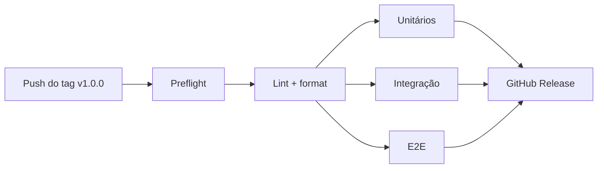

# CI, testes e releases

Como funcionam a integração contínua, os testes no GitHub Actions e o processo de release.

[← Voltar para a documentação](README.md)

O projeto usa apenas a branch `main`. Lint e formatação são verificados a cada push, e a bateria completa de testes roda quando uma nova versão é lançada por tag.

---

## 1. Estrutura de arquivos

```
.
├── .github/
│   ├── pull_request_template.md   # modelo da descrição de pull request
│   ├── scripts/
│   │   └── changelog-section.sh   # extrai a seção de uma versão do CHANGELOG.md
│   └── workflows/
│       ├── ci.yml                 # lint + format (oxlint e oxfmt)
│       ├── tests.yml              # testes unitários, de integração e e2e
│       └── release.yml            # pipeline de release disparado por tag
├── docs/
│   └── CI.md                      # este documento
├── CHANGELOG.md                   # histórico de mudanças por versão
└── package.json                   # scripts usados pelos workflows
```

---

## 2. Quando cada workflow roda

| Evento                                    | Workflow      | O que roda                                                               |
| ----------------------------------------- | ------------- | ------------------------------------------------------------------------ |
| Push na `main`                            | `ci.yml`      | lint + format                                                            |
| Pull request para a `main`                | `ci.yml`      | lint + format                                                            |
| Push de tag `v*.*.*`                      | `release.yml` | preflight → lint + format → unitários, integração e e2e → GitHub Release |
| Manual (Actions → Tests → _Run workflow_) | `tests.yml`   | unitários, integração e e2e                                              |

---

## 3. Os workflows

Todos usam Node 24 e o pnpm na versão do campo `packageManager` do `package.json`, com cache das dependências.

### `ci.yml`: qualidade de código

Roda em todo push e pull request na `main`. Executa:

- `pnpm lint`: análise estática com **oxlint**, com checagem de tipos. Avisos são tratados como erro (`--deny-warnings`).
- `pnpm format:check`: confere a formatação com **oxfmt**, sem alterar arquivos.

Também pode ser chamado por outros workflows (`workflow_call`), e é assim que o `release.yml` o reaproveita.

Se um novo push chegar enquanto um CI anterior da mesma branch ainda está rodando, o anterior é cancelado.

### `tests.yml`: testes

Não roda sozinho em push. É chamado pelo `release.yml` ou disparado manualmente. Executa três jobs em paralelo:

| Job                  | Comando                 | Observações                             |
| -------------------- | ----------------------- | --------------------------------------- |
| Testes unitários     | `pnpm test:unit`        | Sem banco nem rede                      |
| Testes de integração | `pnpm test:integration` | Sobe um Postgres 18 como service do job |
| Testes E2E           | `pnpm test:e2e`         | Sobe um Postgres 18 como service do job |

Os jobs de integração e e2e não usam `.env.test`: as variáveis ficam no bloco `env` do workflow, com os mesmos valores do `.env.test.example`, mas com o banco na porta 5432 do service. As migrations rodam sozinhas no `globalSetup` do Vitest (veja [Testes e comandos](testes.md#5-integração-e-e2e-como-funcionam)).

Para rodar manualmente antes de lançar uma versão: aba **Actions** → **Tests** → **Run workflow**.

### `release.yml`: publicação de versão

Dispara quando um tag no formato `v*.*.*` (ex.: `v1.0.0`) é enviado ao GitHub. As etapas rodam em sequência, e cada uma só começa se a anterior passou:



1. **Preflight**
   - Confirma que o tag aponta para um commit que está na `main`. Um tag criado em outra branch é rejeitado.
   - Confirma que a `version` do `package.json` é a mesma do tag (`v1.0.0` → `1.0.0`).
   - Extrai do `CHANGELOG.md` a seção `## [1.0.0]`. Se ela não existir ou estiver vazia, a release falha aqui, antes de gastar tempo com testes.
2. **Lint + format**: reaproveita o `ci.yml`.
3. **Testes**: reaproveita o `tests.yml`.
4. **GitHub Release**: cria o release com o nome do tag e usa a seção do CHANGELOG como descrição.

---

## 4. Scripts usados pelos workflows

Os workflows não chamam as ferramentas direto, e sim estes scripts do `package.json`:

| Script                  | Comando                                              |
| ----------------------- | ---------------------------------------------------- |
| `pnpm lint`             | `oxlint --type-aware --deny-warnings src/ test/`     |
| `pnpm format:check`     | `oxfmt --check`                                      |
| `pnpm test:unit`        | `vitest run --project unit`                          |
| `pnpm test:integration` | `vitest run --project integration --passWithNoTests` |
| `pnpm test:e2e`         | `vitest run --project e2e --passWithNoTests`         |

Antes de dar push, dá para rodar o mesmo que o CI roda:

```sh
pnpm lint
pnpm format:check   # ou `pnpm format` para corrigir
```

E o mesmo que o `tests.yml` roda, sem precisar de Node local nem `.env.test`:

```sh
pnpm test:docker
```

---

## 5. CHANGELOG

O `CHANGELOG.md` segue o formato [Keep a Changelog](https://keepachangelog.com/pt-BR/1.1.0/) e o versionamento segue o [Semantic Versioning](https://semver.org/lang/pt-BR/).

### Regras

- Mudanças em desenvolvimento ficam em `## [Unreleased]`, no topo.
- Cada versão tem uma seção `## [X.Y.Z] - AAAA-MM-DD`. **O cabeçalho precisa seguir exatamente esse formato**, porque é ele que o pipeline procura.
- Categorias: `Added`, `Changed`, `Deprecated`, `Removed`, `Fixed`, `Security`. Use só as que tiverem conteúdo.
- Escreva para quem usa a API: o que mudou e como isso afeta quem a consome, não detalhes internos de implementação.
- Destaque mudanças que quebram compatibilidade.

### Qual número de versão usar

| Tipo de mudança                | Exemplo                                         | Versão                   |
| ------------------------------ | ----------------------------------------------- | ------------------------ |
| Quebra compatibilidade         | Endpoint removido, formato de resposta alterado | MAJOR: `1.4.2` → `2.0.0` |
| Nova funcionalidade compatível | Novo endpoint, novo parâmetro opcional          | MINOR: `1.4.2` → `1.5.0` |
| Correção compatível            | Bug corrigido                                   | PATCH: `1.4.2` → `1.4.3` |

### Exemplo

```markdown
## [Unreleased]

## [1.1.0] - 2026-10-20

### Added

- `GET /exchange-rates/history` aceita o parâmetro opcional `step` para agrupar por semana.

### Fixed

- `GET /exchange-rates/convert` retornava `500` quando `amount` tinha mais de 20 casas decimais.
```

---

## 6. Como lançar uma versão

1. **(Opcional)** Rode os testes em Actions → Tests → _Run workflow_ para garantir que está tudo verde.
2. No `CHANGELOG.md`, mova o conteúdo de `[Unreleased]` para uma nova seção `## [1.0.0] - 2026-10-05` e deixe `[Unreleased]` vazio.
3. Atualize a versão no `package.json`:

   ```sh
   pnpm version 1.0.0 --no-git-tag-version
   ```

4. Faça o commit, crie o tag e envie:

   ```sh
   git commit -am "version: release v1.0.0"
   git tag v1.0.0
   git push origin main v1.0.0
   ```

5. Acompanhe na aba **Actions**. Se tudo passar, o release aparece em **Releases**.

---

## 7. Fluxo do dia a dia

- **Mudanças pequenas:** commit direto na `main`. O CI roda lint e format a cada push.
- **Mudanças maiores:** crie uma branch curta, abra um pull request para a `main` e faça o merge quando o CI passar.

Ao abrir um pull request, o GitHub preenche a descrição com o modelo do `.github/pull_request_template.md`: tipo da mudança, link da task no Linear, contexto e um checklist de código, qualidade, segurança e variáveis de ambiente.

---

## 8. Problemas comuns

| Erro                                                   | Causa                                                                         | Como resolver                                                   |
| ------------------------------------------------------ | ----------------------------------------------------------------------------- | --------------------------------------------------------------- |
| `CHANGELOG.md não tem a seção ## [X.Y.Z] - AAAA-MM-DD` | A seção da versão não existe, está vazia ou o cabeçalho está em outro formato | Corrija o CHANGELOG, apague e recrie o tag (veja abaixo)        |
| `O tag vX.Y.Z não aponta para um commit da main`       | O tag foi criado em outra branch                                              | Apague o tag, faça o merge na `main` e recrie                   |
| `package.json está na versão A, mas o tag é vB`        | Faltou o `pnpm version` (passo 3)                                             | Atualize o `package.json`, faça o commit, apague e recrie o tag |
| Falha no lint ou no format check                       | Aviso do oxlint ou código não formatado                                       | `pnpm lint:fix` / `pnpm format`, commit e push                  |
| Falha na integração ou no e2e                          | Teste quebrado, ou migration que não roda num banco vazio                     | Reproduza com `pnpm test:docker`, que sobe um banco limpo       |
| `ERR_PNPM_OUTDATED_LOCKFILE`                           | Dependência alterada no `package.json` sem atualizar o `pnpm-lock.yaml`       | `pnpm install`, commit do lockfile e push                       |

### Recriar um tag depois de uma falha

Se a release falhou e você corrigiu o problema:

```sh
git tag -d v1.0.0                  # apaga localmente
git push origin :refs/tags/v1.0.0  # apaga no GitHub
# corrija, faça o commit e o push
git tag v1.0.0
git push origin v1.0.0
```

Como o release só é criado no último passo, um pipeline que falhou não deixa release publicado para trás.

---

## Como manter esta página

- **Mudou um workflow?** Atualize as seções 2 e 3.
- **Mudou um script usado pelos workflows?** Atualize a tabela da seção 4.
