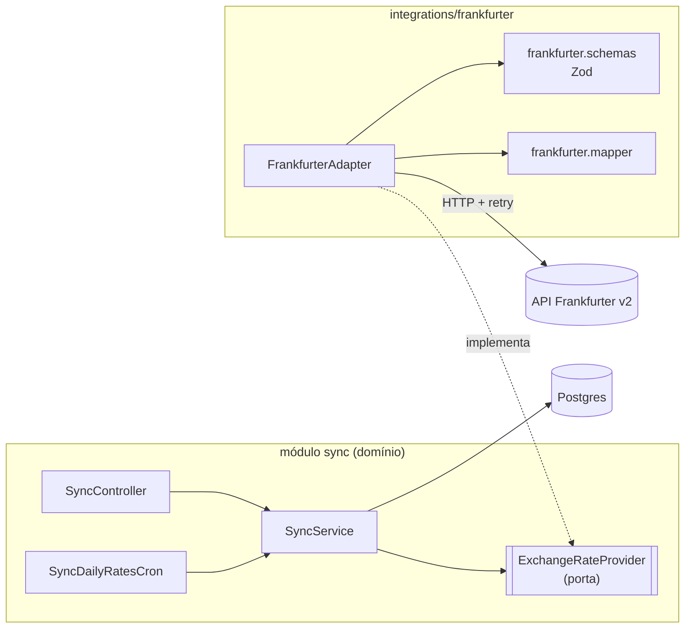
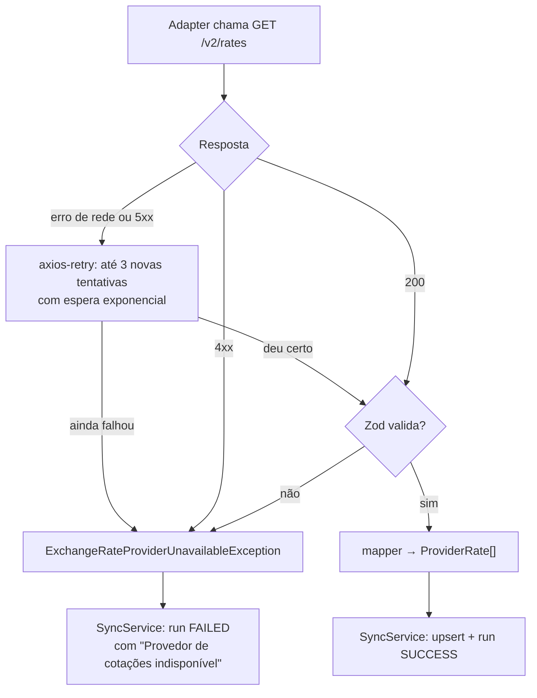

# Arquitetura: a integração com a Frankfurter (ports and adapters)

Como o projeto busca cotações em um provedor externo sem que o resto do código dependa dele.

[← Voltar para a documentação](README.md)

---

## 1. A ideia em uma frase

O `SyncService` precisa de cotações, mas não sabe de onde elas vêm: ele depende de uma **porta** (`ExchangeRateProvider`), um contrato que diz _o que_ ele precisa. A Frankfurter entra por um **adapter** (`FrankfurterAdapter`), que implementa esse contrato e é o único lugar do projeto que conhece a API externa.

Esse é o padrão **ports and adapters** (também chamado de arquitetura hexagonal), aplicado só onde ele se paga: na fronteira com o mundo externo. O resto do projeto segue as camadas comuns do Nest (controller → service → repositório).



A seta importante é a pontilhada: **o adapter depende da porta, e não o contrário**. O `SyncService` nunca importa nada de `src/integrations/`.

---

## 2. As peças

```
src/
├── sync/
│   ├── ports/
│   │   └── exchange-rate-provider.port.ts   ← a porta (contrato + tipos + exceção)
│   ├── sync.service.ts                      ← usa a porta
│   └── sync.module.ts                       ← importa o FrankfurterModule
│
└── integrations/
    └── frankfurter/
        ├── frankfurter.module.ts            ← HTTP, timeout, retry e a ligação porta → adapter
        ├── frankfurter.adapter.ts           ← implementa a porta
        ├── frankfurter.schemas.ts           ← valida a resposta com Zod
        └── frankfurter.mapper.ts            ← converte a resposta para o formato do domínio
```

### A porta: `src/sync/ports/exchange-rate-provider.port.ts`

Fica **dentro do módulo `sync`**, porque é o sync quem define do que precisa. Tem quatro coisas:

| Item                                                 | O que é                                                                                      |
| ---------------------------------------------------- | -------------------------------------------------------------------------------------------- |
| `ExchangeRateProvider`                               | Classe abstrata com os dois métodos que o sync usa: `fetchRecentRates` e `fetchRatesInRange` |
| `ProviderRate`                                       | O formato que volta da porta: `{ currencyCode, rate, rateDate }`, tudo `string`              |
| `FetchRecentRatesParams` / `FetchRatesInRangeParams` | Os parâmetros: `base` e `currencies`, mais `days` ou `start`/`end`                           |
| `ExchangeRateProviderUnavailableException`           | O único erro que a porta lança, seja qual for o motivo da falha                              |

```ts
export abstract class ExchangeRateProvider {
  abstract fetchRecentRates(params: FetchRecentRatesParams): Promise<ProviderRate[]>;

  abstract fetchRatesInRange(params: FetchRatesInRangeParams): Promise<ProviderRate[]>;
}
```

> **Por que classe abstrata e não `interface`?** Interfaces do TypeScript somem depois de compilar, e o Nest precisa de algo que exista em tempo de execução para usar como token de injeção. A classe abstrata serve como contrato **e** como token: o `SyncService` pede `ExchangeRateProvider` no construtor, sem `@Inject('...')` nem string mágica.

O `rate` é `string` de propósito: é o mesmo formato da coluna `numeric` no banco e do `Decimal` usado nos cálculos, então a cotação nunca passa por um `number` no lado do domínio.

### O adapter: `src/integrations/frankfurter/`

| Arquivo                  | Responsabilidade                                                                                                         |
| ------------------------ | ------------------------------------------------------------------------------------------------------------------------ |
| `frankfurter.adapter.ts` | Monta os parâmetros (`base`, `quotes`, `from`, `to`), chama `GET /v2/rates`, valida e converte a resposta, traduz erros  |
| `frankfurter.schemas.ts` | Schema Zod de cada linha da resposta: `{ date: 'AAAA-MM-DD', base, quote, rate: number > 0 }`                            |
| `frankfurter.mapper.ts`  | `{ date, quote, rate }` da Frankfurter → `{ rateDate, currencyCode, rate: String(rate) }` da porta                       |
| `frankfurter.module.ts`  | Configura o `HttpModule` (URL base do namespace `frankfurter`, timeout de 10 s), o `axios-retry` e a ligação com a porta |

### A ligação

Quem decide que a porta é atendida pela Frankfurter é o módulo do adapter:

```ts
@Module({
  imports: [HttpModule.registerAsync({ ... })],
  providers: [{ provide: ExchangeRateProvider, useClass: FrankfurterAdapter }],
  exports: [ExchangeRateProvider],
})
export class FrankfurterModule { ... }
```

O `SyncModule` importa o `FrankfurterModule` e recebe a porta já resolvida. O `FrankfurterModule` exporta **só a porta**: o `FrankfurterAdapter` e o `HttpService` configurado não ficam visíveis para o resto da aplicação.

---

## 3. O que fica de cada lado

| Responsabilidade                                         | Onde fica                                 |
| -------------------------------------------------------- | ----------------------------------------- |
| Saber a URL, o formato e os parâmetros da Frankfurter    | Adapter                                   |
| Timeout, retry e espera entre tentativas                 | `FrankfurterModule` (axios + axios-retry) |
| Validar a resposta externa                               | Adapter (Zod)                             |
| Converter para o formato do domínio                      | Adapter (mapper)                          |
| Decidir quais moedas buscar e qual a base (USD)          | `SyncService`                             |
| Registrar a execução em `sync_runs`                      | `SyncService`                             |
| Gravar as cotações (upsert) e ignorar moeda desconhecida | `SyncService`                             |
| Pausa de 7 s entre os anos da carga inicial              | `SyncService`                             |
| Traduzir a falha para a mensagem do usuário (i18n)       | `SyncService`                             |

O adapter não conhece banco, i18n nem `sync_runs`. O `SyncService` não conhece HTTP, axios nem o formato da Frankfurter.

---

## 4. Erros e retry



- **Retry** só para falhas que podem passar sozinhas: sem resposta (rede, timeout) ou `5xx`. Um `4xx` é erro do pedido e não adianta repetir. Cada tentativa tem o próprio timeout de 10 s (`shouldResetTimeout`).
- **Toda falha vira `ExchangeRateProviderUnavailableException`**, com o erro original guardado em `originalError` para o log. Assim o `SyncService` trata um único tipo de erro, sem saber se foi axios, timeout ou Zod.
- **Uma resposta que não passa no Zod não é gravada.** Melhor ficar sem as cotações do dia do que salvar um valor errado. A API continua respondendo com os dados que já estão no banco.

---

## 5. Como isso aparece nos testes

A porta é o que deixa cada tipo de teste trocar só o que precisa:

| Teste                                                | O que roda de verdade                          | O que é simulado                          |
| ---------------------------------------------------- | ---------------------------------------------- | ----------------------------------------- |
| `test/unit/frankfurter/frankfurter.adapter.spec.ts`  | `FrankfurterModule` inteiro (HTTP, retry, Zod) | A rede, com `nock`                        |
| `test/unit/sync/sync.service.spec.ts`                | `SyncService`                                  | A porta e os repositórios, com `vi.fn()`  |
| `test/integration/*` e a maior parte de `test/e2e/*` | App inteiro + Postgres                         | A porta, com o `FakeExchangeRateProvider` |
| `test/e2e/frankfurter-flow.e2e-spec.ts`              | App inteiro + Postgres + adapter real          | Só a rede, com `nock`                     |

O `FakeExchangeRateProvider` (`test/utils/`) implementa a mesma porta, e o `createTestingApp` troca um pelo outro com `overrideProvider(ExchangeRateProvider)`. Nenhum teste chama a Frankfurter de verdade. Detalhes em [Testes e comandos](testes.md).

---

## 6. Trocando ou adicionando um provedor

Para usar outro provedor no lugar da Frankfurter:

1. Criar `src/integrations/<provedor>/` com um adapter que implementa `ExchangeRateProvider`, o schema da resposta e o mapper.
2. No módulo novo, `providers: [{ provide: ExchangeRateProvider, useClass: <Provedor>Adapter }]` e `exports: [ExchangeRateProvider]`.
3. No `SyncModule`, trocar o import do `FrankfurterModule` pelo módulo novo.
4. Se precisar de configuração (URL, API key), criar o namespace em `src/config/` (veja [Configuração](configuracao.md)).
5. Escrever o unitário do adapter com `nock`, como o da Frankfurter.

O `SyncService`, os endpoints, o banco e os testes de integração e e2e não mudam.

---

## 7. Regras do projeto

- O `SyncService` (e qualquer código fora de `src/integrations/`) importa só de `@ports/`, nunca de um adapter.
- O adapter não acessa banco nem i18n, e não lança outro erro além de `ExchangeRateProviderUnavailableException`.
- A porta muda só quando o **sync** precisa de algo novo, não porque o provedor mudou o formato. Mudança de formato fica no schema e no mapper.
- Dados externos sempre passam pelo Zod antes de virar `ProviderRate`.

---

## Como manter esta página

- **Mudou a assinatura da porta** (método, parâmetro ou tipo)? Atualize a seção 2 e o diagrama da seção 1, se aparecer lá.
- **Mudou timeout, número de tentativas ou a condição de retry** no `frankfurter.module.ts`? Atualize a seção 4.
- **Trocou ou adicionou um provedor?** Atualize as seções 1 e 2 e siga o roteiro da seção 6.
- **Criou um teste que simula a porta ou a rede de outro jeito?** Inclua na tabela da seção 5.
