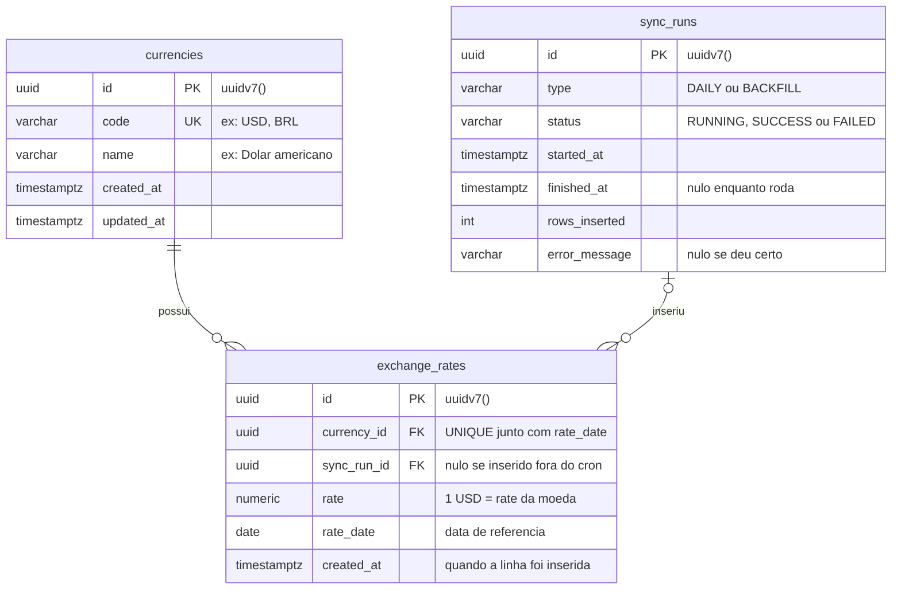

# Modelo de dados

O banco tem três tabelas. As migrations que criam cada uma ficam em `src/database/migrations/`.

[← Voltar para a documentação](../README.md)

## O que cada tabela guarda

**`currencies`**: as moedas suportadas (USD, BRL, EUR...). É preenchida pela migration `SeedCurrencies`, não pela API. Para incluir uma moeda, veja [Como adicionar uma moeda](../../README.md#como-adicionar-uma-moeda).

**`exchange_rates`**: uma linha por moeda por dia. O valor `rate` é sempre em relação ao **USD** (`1 USD = rate`), por isso o USD não tem linhas aqui. Qualquer outro par, como EUR → BRL, é calculado na hora da leitura: `rate(BRL) / rate(EUR)`.

- O par `(currency_id, rate_date)` é único. Se a mesma cotação chegar de novo, ela é atualizada em vez de duplicada (`UPSERT`).
- `rate` é `numeric` para não perder precisão. No código ele chega como `string` e as contas são feitas com `decimal.js`.

**`sync_runs`**: o histórico de cada execução da sincronização, tanto do cron diário (`DAILY`) quanto da carga inicial (`BACKFILL`). Se a Frankfurter falhar, é aqui que fica o `error_message`.

## Relacionamentos

| Relação                       | Cardinalidade  | Leitura                                                                                         |
| ----------------------------- | -------------- | ----------------------------------------------------------------------------------------------- |
| `currencies` → `exchange_rates` | 1 para N       | Toda cotação pertence a uma moeda                                                               |
| `sync_runs` → `exchange_rates`  | 0..1 para N    | A cotação guarda qual execução a inseriu; fica nula se foi inserida fora da sincronização |

## Como manter este diagrama

Sempre que uma migration criar, remover ou alterar uma coluna, atualize o bloco `mermaid` acima e, se mudar o significado da tabela, o texto da seção correspondente. O GitHub renderiza o Mermaid sozinho; para testar antes de commitar, cole o bloco em [mermaid.live](https://mermaid.live).
