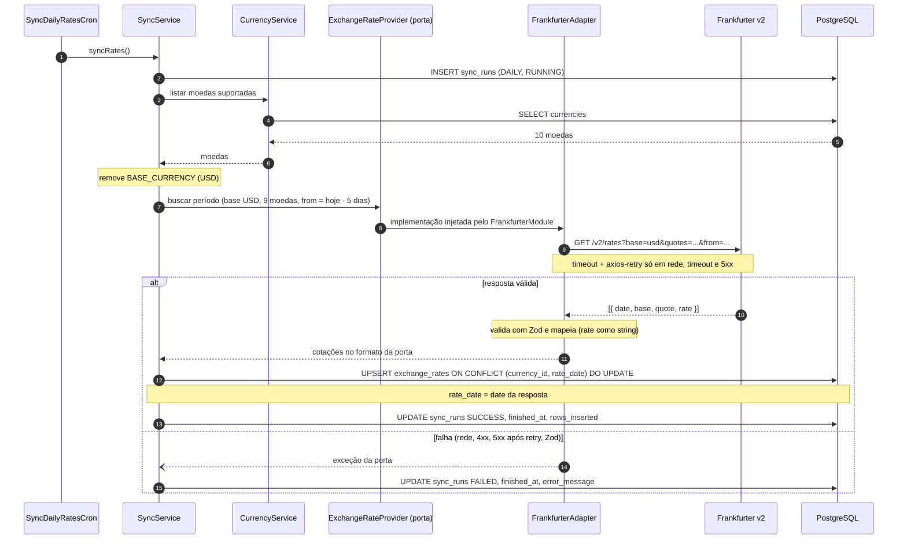
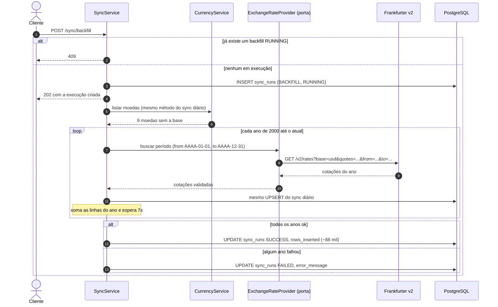
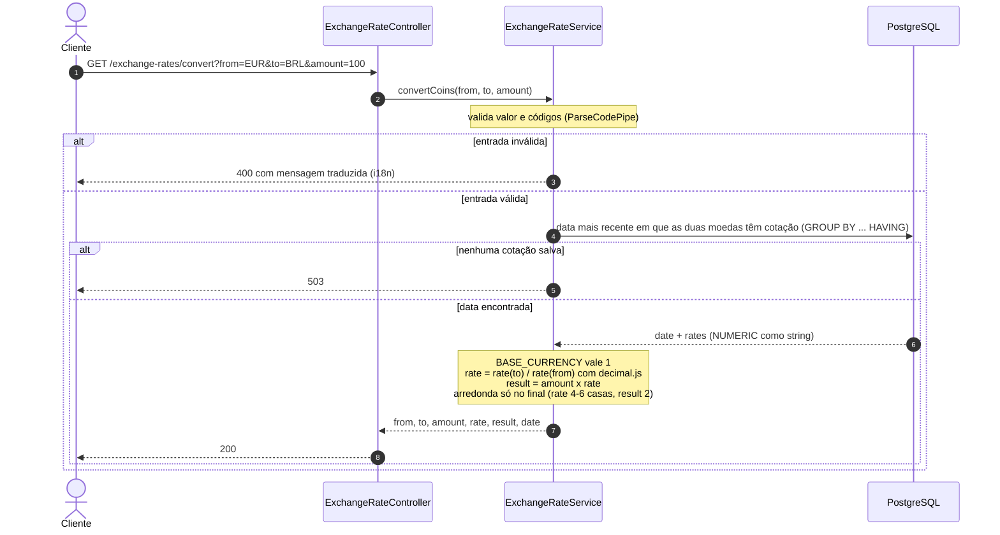
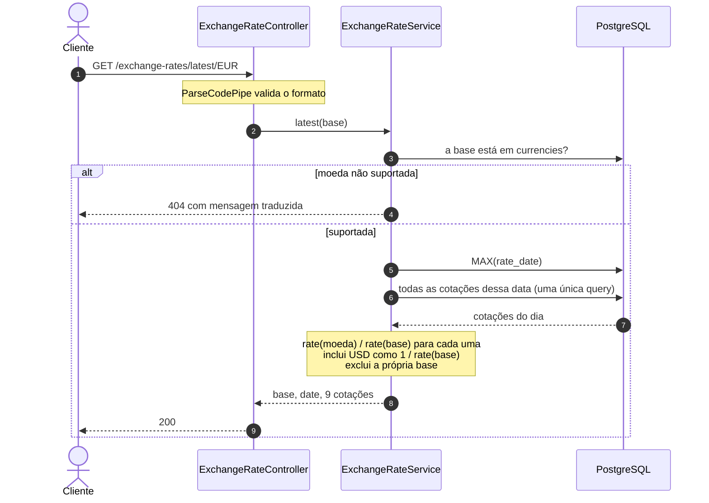
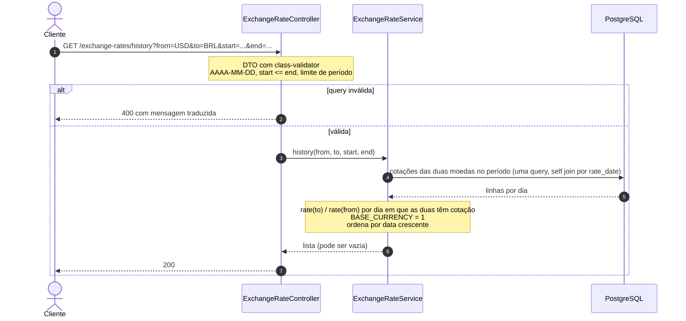
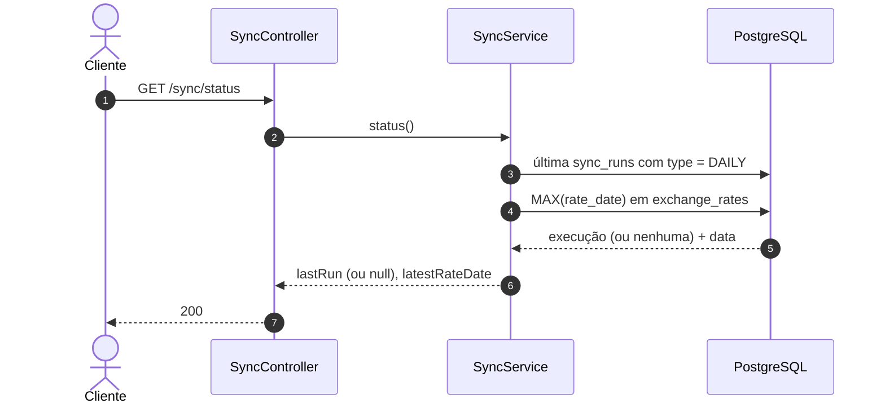

# Diagramas de sequência

Mostram, passo a passo, quem chama quem em cada fluxo da API. Foram feitos a partir do documento "Arquitetura e decisões" e das tasks API-9 a API-14 do Linear.

[← Voltar para a documentação](../README.md)

## Como ler

- Cada coluna é uma parte do sistema (classe, banco ou API externa). As setas mostram a ordem das chamadas, numeradas.
- Seta cheia (`->>`) é uma chamada; seta tracejada (`-->>`) é a resposta.
- Blocos `alt` / `else` são caminhos alternativos (sucesso ou erro). Blocos `loop` se repetem.
- As notas amarelas explicam uma regra que acontece naquele ponto.

O projeto tem dois tipos de fluxo, que só se encontram no banco:

- **Escrita** ([sincronização diária](#sincronização-diária) e [carga inicial](#carga-inicial-desde-2000)): buscam cotações na Frankfurter e salvam no PostgreSQL.
- **Leitura** ([convert](#get-exchange-ratesconvert), [latest](#get-exchange-rateslatestbase), [history](#get-exchange-rateshistory) e [sync/status](#get-syncstatus)): só leem do banco, nunca chamam a Frankfurter.

---

## Sincronização diária

Roda todo dia às 6h (horário de Brasília) e busca os **últimos 5 dias**. A janela de 5 dias corrige valores que o provedor revisou e recupera dias perdidos se o cron falhar em algum dia. O `SyncService` não conhece a Frankfurter: ele fala com a porta `ExchangeRateProvider`, e o `FrankfurterAdapter` é quem faz o HTTP. Qualquer falha fica registrada em `sync_runs`, e a API continua respondendo com os dados já salvos.

## Carga inicial desde 2000

Disparada por `POST /sync/backfill`. Responde `202` na hora e continua em segundo plano. Busca **um ano por chamada**, de 2000 até o ano atual, com uma pausa de 7 segundos entre os anos para respeitar o limite da Frankfurter. Usa o mesmo `UPSERT` do sync diário, então rodar de novo não duplica dados.

## GET /exchange-rates/convert

Converte um valor entre duas moedas. Usa a data mais recente em que **as duas** moedas têm cotação. Como tudo é salvo em relação ao USD, a taxa do par é `rate(to) / rate(from)` (taxa cruzada). As contas usam `decimal.js` e só arredondam no final.

## GET /exchange-rates/latest/:base

Lista as cotações mais recentes de todas as moedas em relação a uma base. Faz uma única query para buscar todas as cotações do dia e calcula cada par em memória.

## GET /exchange-rates/history

Histórico de um par de moedas em um período. Só entram os dias em que as duas moedas têm cotação. Um período sem dados devolve lista vazia, não erro.

## GET /sync/status

Mostra se a sincronização diária está em dia: a última execução do cron e a data da cotação mais recente salva.

---

## Como manter estes diagramas

- **Mudou um fluxo existente?** Atualize o diagrama dele e o parágrafo logo acima.
- **Criou um endpoint ou fluxo novo?** Adicione uma seção `##` com o nome do endpoint, um parágrafo curto dizendo o que ele faz e o diagrama. Copie um diagrama parecido como ponto de partida.
- Teste o diagrama em [mermaid.live](https://mermaid.live) antes de commitar; o GitHub renderiza o mesmo código.
